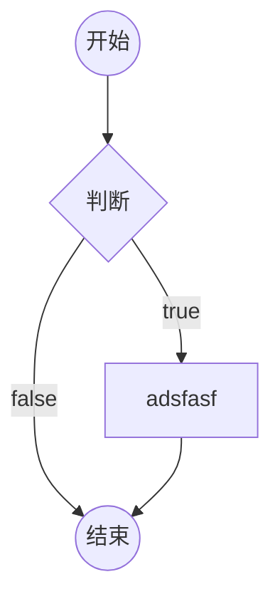
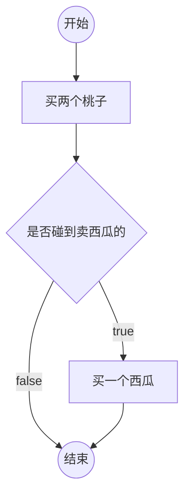
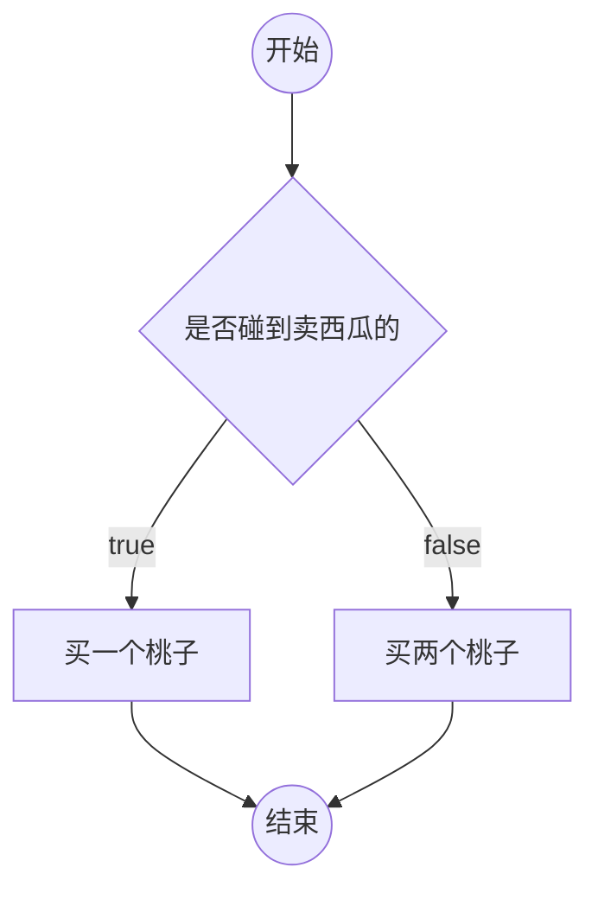
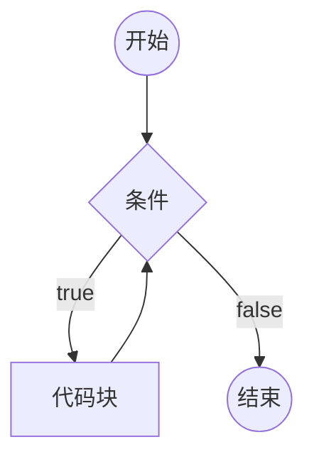
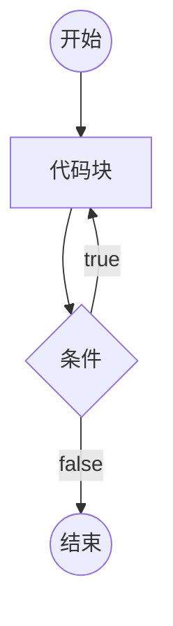
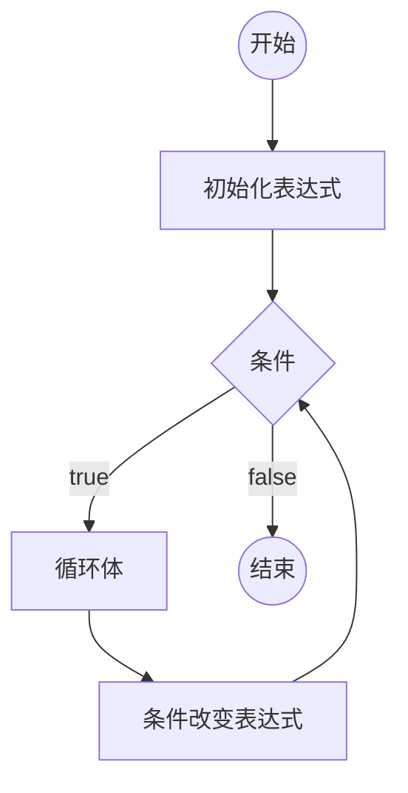

---
{"dg-publish":true,"permalink":"/02_Javascript/javascript-particular/4.流程控制/","created":"2025-07-09T20:19:14.031+08:00","updated":"2025-07-16T10:03:07.368+08:00"}
---

# 1.流程图

一套的标准的图形，用于描述程序的逻辑

通常流程图分析程序的流程


## 在 markdown 中画流程图



## 例子

邓哥的思维：



成哥的思维：



# 2.if判断

```js
if(条件1){
    // 代码块
}
else if(条件2){
    // 代码块
}
else if(条件3){
    // 代码块
}
//....
else{
    // 以上条件都不满足执行的代码块
}
```

1. 如果某个条件满足，则直接忽略后面的所有条件
2. else if 可以有多个（包含0个）
3. else可以有1个或0个
4. else可以换行，可以不换行
5. 如果代码块只有一条语句，可以省略花括号（不推荐）
6. if只能出现一次


## 补充：prompt、random

用户输入: prompt("提示文本")

该表达式结果：

  1. null：表示用户点击了取消

  2. 用户输入的字符串：表示用户点击了确定，得到用户输入的结果

返回类型：null 或 字符串

将字符串转换成数字：+“字符串”

```js
// 等待用户操作（确定，取消），将用户操作的结果保存到变量result中
// 让用户输入一个数字，如果点击了取消，输出取消，如果点击了确定，根据输入的内容判断输入是否正确
var result = prompt("请输入你的年龄");
if (result === null) {
    console.log("点击了取消");
} else {
    result = +result; //转换为数字
    if (isNaN(result)) {
        //不是正常的数字
        console.log("输入有误");
    }
    else{
        console.log(result, typeof result);
    }
}
```


3. 得到一个随机数

Math.random() 该表达式返回一个0~1之间的随机数字（无法取到1）

# 3.switch 开关

switch的语法始终可以使用if结构替代。

```js
switch(表达式){
    case 数据1:
        代码块
    case 数据2:
        代码块
    //...
    default:
        代码块
}
```

1. 计算表达式的返回值，依次和case后面的数据进行严格相等的比较，如果某个相等，停止比较，然后运行其内部的代码块，再然后，依次运行之后的所有代码块。
2. 在case分支内部，使用break语句，可以立即停止switch结构。
3. default表示前面的所有case都不匹配时运行。可以省略

# 4.循环

重复的运行一段代码

JS支持3种循环结构：while循环、do-while循环、for循环

## while循环

```js
while(条件){
    代码块（循环体）
}
```



死循环：条件永远满足，永远无法退出循环。

## do-while循环

```js
do{
    循环体
} while(条件);
```




## for循环

```js
for(初始化表达式; 条件; 条件改变表达式){
    循环体
}
```




## 循环中的关键字

循环控制语句

- break; 跳出循环
- continue; 停止当前循环体，进入下一次循环。
# 5.循环应用

## 累计

举例：将1-100的所有数字相加之和

思路：准备一个变量，初始值为0，然后1-100循环，每次循环，将数字累加到变量中。

## 查找

举例：135~145之间是否存在能整除26的数字

思路：准备一个变量，记录false，表示没有找到，然后135-145进行循环，如果发现满足条件的数字，重新记录变量为true，表示找到了，然后退出循环。

## 嵌套的循环

分开分析两层循环
# 6.数组

数组用于存放多个数据

## 创建一个数组

1. new Array(长度)
	
	长度，数组里面的数据总数，长度一定是一个非负整数
	
	new Array(数据, 数据, 数据....)
	
	创建一个数组，并初始化其每一项的值
	
	数组项：数组其中的一项数据

2.字面量创建： \[数据,数据,数据,....]
	创建一个数据，并初始化其每一项的值
```js
var arr = [1, 5, 354, 234, 11];
var arr = [34, "asdf", true, null, undefined, {
	x: 1,
	y: 34
}];
console.log(arr, typeof arr);
console.log(arr, arr.length);
```

## 认识数组的本质

数组的本质是一个对象
自动生成属性名（按索引）和一个长度属性
```js
var arr = [1, 5, 354, 234, 11];
var arr = [34, "asdf", true, null, undefined, {
	x: 1,
	y: 34
}];
var obj = {
	0:34,
	1:"asdf",
	2:true,
	3:null,
	4:undefined,
	5:{
		x:1,
		y:34
	}
}
console.log(arr, typeof arr);
console.log(obj, typeof obj);
//访问对象的数字属性需要通过属性表达式
console.log(obj.0); // 0不是合法的标识符
console.log(obj["0"]); // 属性表达式
console.log(obj[0]); // js会自动将0转换为字符串"0"
```

- length属性：数组的长度，会自动变化，值为最大下标+1
- 数字字符串属性：叫做下标，也叫做索引，相当于数组中每个数据的编号，下标从0开始排列


连续下标的取值范围：0 ~ length -1，如果给length直接赋值，会导致数组可能被截断

实际开发中，不要给length赋值。

## 下标

通常情况下，下标是连续的。

下标不连续的数组，叫做稀松数组。

## 数组的常见操作

### 添加数组项

- 数组\[长度] = 数据：向数组末尾添加一个数据
- 数组.push(数据): 向数组末尾添加一个数据，返回数组长度。
- 数组.unshift(数据)：向数组起始位置添加一个数据，会导致数组每一项的下标向后移动
- 数组.splice(下标, 删除的数量, 添加的数据): 从指定下标位置开始，删除0个，然后在该位置插入添加的数据，如果下标超过范围，则按照范围的边界进行处理。
>`splice()` 方法的返回值是**一个由被删除元素组成的新数组**。如果没有删除任何元素，则返回一个空数组。

push、unshift、splice可以添加多个数据

### 删除数据

- delete 数组\[下标]: 这种做法不会导致数组其他的属性发生变化，因此，该做法会导致产生稀松数组，所以不推荐使用该做法。
- 数组.pop(): 删除数组的最后一项，该表达式返回最后一项的数据
- 数组.shift()：删除数组第一项，该表达式返回删除的数据
- 数组.splice(下标, 删除的数量, 添加的数据): 从指定下标位置开始，删除指定数量，然后在该位置插入添加的数据，如果下标超过范围，则按照范围的边界进行处理。返回一个新数组，该数组记录被删除的数据。

### 其他操作

- 数组.slice(起始位置下标, 结束位置下标)：将起始位置到结束位置之间的数据拿出来，得到一个新的数组，该函数不会改变原数组；注意：结束下标取不到
	下标可以写负数，如果是负数，则从数组的末尾开始计算。
	
	如果不写结束下标，则直接取到末尾。
	```js
	var arr = [1, 2, 3, 4, 5, 6, 7];
	var newArr = arr.slice(-4);
	arr.splice(0, arr.length);
	console.log(newArr, arr);//[4, 5, 6, 7] []
	```

- 数组清空
	
	数组.splice(0, 数组.length);
	
	数组.length = 0;

- 查找数组中某一项的下标
	
	数组.indexOf(数据)
	
	从数组中依次查找对应的数据，查找时使用严格相等进行比较。找到第一个匹配的下标，返回。如果没有找到，则返回-1；
	```js
	var arr = [1, 2, 3, 4, 3, 6, 3];
	var index = arr.IndexOf(3);
	console.log(arr, index);//[1, 2, 3, 4, 3, 6, 3]，2
	```
	数组.lastIndexOf(数据)
	
	功能和indexOf类似，只是查找的是最后一个匹配的下标

- 数组.fill
	数组.fill(数据)：将数组的所有项，填充为指定的数据
	
	数组.fill(数组, 开始下标): 将数组从开始下标起，到数组的末尾，填充为指定的数据
	
	数组.fill(数组, 开始下标，结束下标): 将数组从开始下标起，到数组的结束下标（取不到），填充为指定的数据
```js
// 创建一个长度为100的数组，给数组的每一项赋值为"abc"
var arr = new Array(100);
arr.fill("abc");
arr.fill("cba",3,5);//下标3，4项填充为cba
```

## 语法补充

### in关键字

判断某个属性在对象中是否存在

属性名 in 对象
```js
var obj = {
	a: 1,
	b: 324,
	c: "asdfas"
};

console.log("a" in obj);//true
console.log(a in obj);//false

var arr = [23, 65, 7, 7];
console.log(arr);
console.log(23 in arr);//false，因为23不是属性名，而是值
```
### for-in  foreach 循环

```js
for(var prop in 对象){
    //循环体
}
```

取出对象的所有属性名，每次循环将其中一个属性名赋值给变量prop，运行循环体。
```js
var obj = {
	a: 1,
	b: 32,
	c: "asd"
};

for (var prop in obj) {
	console.log(prop);
}//a,b,c

// 利用该特点，可以实现数组的遍历
var arr = ["abc", "bcd", "234", , , , 54, 2, 1];
console.log(arr);
// for (var i = 0; i < arr.length; i++) {
//     console.log(arr[i]);
// }

for (var index in arr) {
	console.log(index, typeof index, arr[index]);
}

```
两种遍历方式的区别是for-in循环不会遍历到稀松数组的空项，而前者如果遍历到空项会返回undefined。

# 7.数组应用

- 数组的本质是对象，引用类型，存放的是内容地址而不是内容本身
```js
// 面试题
// 数组的本质：对象 （引用类型）
var arr1 = [3, 5, 7, 8, 2]; // arr1中存放的是地址
var arr2 = arr1; // arr2中存放的是地址
arr2[0] = 5;
console.log(arr1 === arr2);// true
console.log(arr1[0], arr2[0]);// 5 5

// 如何复制（克隆，产生一个全新的对象）
var arr1 = [3, 5, 7, 8, 2];
var arr2 = arr1.slice(); 
arr2[0] = 5;
console.log(arr1 === arr2);// false
console.log(arr1[0], arr2[0]);// 3 5
```
- 二维数组
```js
var arr = [
	[1, 2, 34],
	[345, 1, 1],
	[44, 4, 7]
];
```
- 字符串拼接
```js
// 将数组的每一项进行字符串拼接

var arr = [3, 4, 6, 1, 3];

// 输出：3, 4, 6, 1, 3
var str = "";
for (var i = 0; i < arr.length; i++) {
	str += arr[i];
	if (i < arr.length - 1) {
		str += ",";
	}
}

// 数组.join(分隔符)，该函数返回一个字符串
//let str = arr.join(',');//3,4,6,1,3
let str = arr.join('');//34613
console.log(str);
```
- 数组拼接`concat`
```js
var arr1 = [34, 5, 2, 1];
var arr2 = ["abc", "bcd"];
// 数组1.concat(数组2)
// 将数组2的所有元素 拼接到 数组1 的末尾，产生一个新数组返回，该表达式不会对原数组造成任何影响
arr1 = arr1.concat(arr2);
console.log(arr1);//[34, 5, 2, 1, "abc", "bcd"]
```
